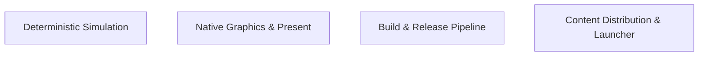
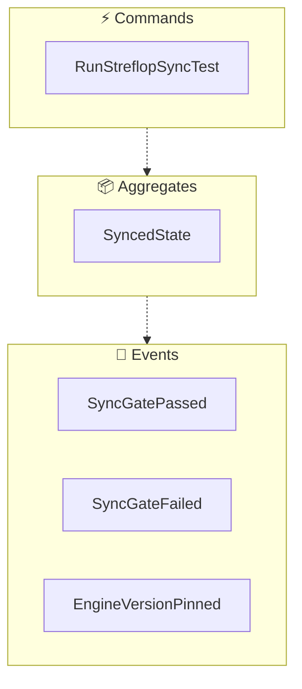
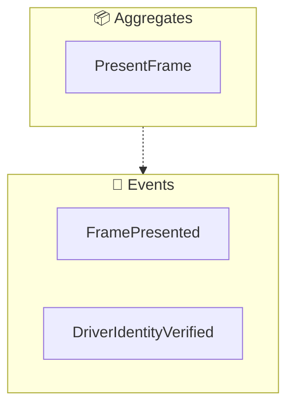
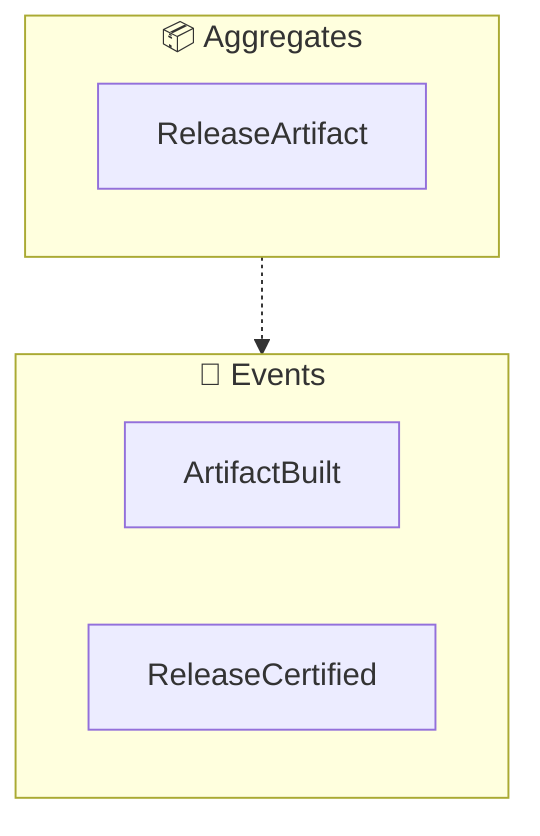
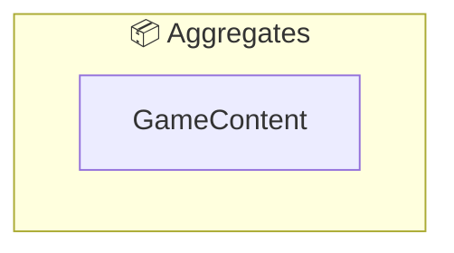

<!-- THIS FILE IS AUTO-GENERATED FROM spec/foundation.json -->
<!-- DO NOT EDIT THIS FILE DIRECTLY -->
<!-- Edit spec/foundation.json and run: fspec generate-foundation-md -->

# bar-macos Project Foundation

## Vision

A native Apple Silicon build of the Recoil RTS engine that lets Beyond All Reason run on macOS with full graphics and bit-exact, cross-platform multiplayer — no Rosetta, no VM, no desync.

---

## Problem Space

### BAR players on Apple Silicon Macs cannot play natively

Beyond All Reason ships no official macOS build. Apple Silicon Mac users must run Windows builds under Rosetta or a VM (slow, fragile, and not multiplayer-safe), and prior native ARM64 attempts desynced in lockstep multiplayer because Apple's libm, float-to-int conversion, and FMA contraction produce per-ULP-different simulation results than the x86 fleet — a Mac client that desyncs is unplayable in public matches.

**Impact:** high

---

## Solution Space

### Overview

A curated, rebaseable macOS layer on top of the pinned upstream Recoil engine (2025.06.24) that makes the sim bit-exact on arm64 (fleet-parity libm, x86 float-to-int semantics, no FMA contraction), renders OpenGL 4.6 natively via Mesa Zink + KosmicKrisp into Metal, and ships one-command, reproducible build/certify/release tooling plus a drag-to-install BAR launcher — so a Mac client joins the same live multiplayer fleet as Windows/Linux.

### Capabilities

- **Bit-Exact Cross-Architecture Simulation**: A Mac client computes a bit-identical simulation to the Windows/Linux fleet: fleet-parity glibc libm for double math, x86 float-to-int conversion semantics on arm64, FMA contraction disabled, and the sim + streflop layers untouched behaviorally
- **Native Metal Graphics Path**: OpenGL 4.6 compatibility profile on Apple Silicon via the pinned Mesa Zink + KosmicKrisp driver stack translating into Metal, with a rebuilt EGL context and readback/present pipeline (unified-memory direct present, IOSurface fallback), Retina/HiDPI, window resize, borderless fullscreen, and loud failure instead of silent software-GL fallback
- **One-Command Reproducible Build and Release**: Reproducible, one-command pipeline (make app / engine / engine-dist / certify / release) that builds the pinned Mesa driver, builds the engine with the deterministic-FP configuration, runs the determinism gates, and produces staged, signed, notarized .app/.dmg/.zip artifacts with provenance-stamped driver builds
- **BAR Launcher and Content Distribution**: Drag-to-install BAR Launcher.app that (after an explicit consent prompt) downloads Beyond All Reason from the official content network, keeps it updated, and launches into the lobby; also ships as an engine-only distro for other game communities
- **Determinism Certification and Gates**: Certification that a shipped build stays multiplayer-safe: streflop cross-arch bit-exactness test, 9/9 fleet libm hash gate, full-length replay re-simulation (REPLAY_SYNC_OK), live cross-platform match matrix, GPU driver-identity smoke, artifact verification (file/otool/lipo), and version pinning to the engine version the live fleet runs
- **Upstream Maintenance and Version Pinning**: The macOS layer stays a thin, rebaseable patch set on upstream: version-bump / rebase-onto-a-new-release procedure, upstream candidate tracking so the patch series shrinks over time, pinned dependency versions with documented rationale, and runtime knobs (springsettings config + env escape hatches) for diagnosis without recompiling

---

## Personas

### Mac Player

A Beyond All Reason player on an Apple Silicon Mac who wants to play the game natively — including public multiplayer — without Rosetta, a VM, or desyncing against the official fleet

**Goals:**
- Play BAR natively on macOS at display-class frame rates
- Join live multiplayer matches with the official Windows/Linux builds
- Install and keep the game updated without manual steps

### Port Maintainer

Maintainer or contributor of the macOS layer (human or AI-assisted) who keeps the port rebaseable, deterministic, and upstreamable; works in a repo with hard rules (sim untouchable, no fast-math, thin patch series) and a multi-tier verification ladder

**Goals:**
- Ship certified, notarized macOS builds from the pinned upstream release
- Keep the sim bit-exact — pass every determinism gate on every change
- Keep the macOS layer a thin, rebaseable, upstreamable patch series

---

# Domain Architecture

## Bounded Contexts

- Deterministic Simulation
- Native Graphics & Present
- Build & Release Pipeline
- Content Distribution & Launcher

## Bounded Context Map

## Deterministic Simulation Context

### Event Flow

**Aggregates:**
- SyncedState

**Domain Events:**
- SyncGatePassed
- SyncGateFailed
- EngineVersionPinned

**Commands:**
- RunStreflopSyncTest

## Native Graphics & Present Context

### Event Flow

**Aggregates:**
- PresentFrame

**Domain Events:**
- FramePresented
- DriverIdentityVerified

## Build & Release Pipeline Context

### Event Flow

**Aggregates:**
- ReleaseArtifact

**Domain Events:**
- ArtifactBuilt
- ReleaseCertified

## Content Distribution & Launcher Context

### Event Flow

**Aggregates:**
- GameContent

---
